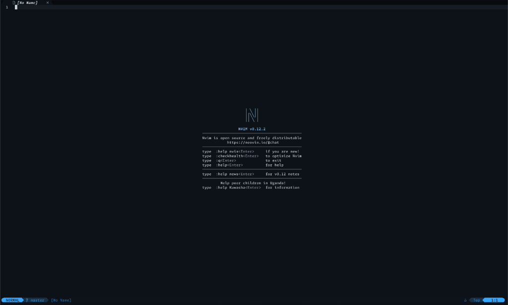

# Modular Neovim Configuration

A clean, modular, and production-grade Neovim configuration built for modern software development. Optimized for performance (sub-100ms startup) and configured for an IDE-like experience using standard Neovim Lua APIs.

---

## 📂 Directory Structure

The configuration is organized under `lua/` as a modular architecture where each subdirectory handles a single, well-defined concern:

```
~/.config/nvim/
├── init.lua                 # Main entry point; boots options, keymaps, lazy.nvim
├── lazy-lock.json           # Lockfile tracking exact plugin versions
├── README.md                # This guide
│
├── assets/                  # Images and graphics
│   └── neovim_startup.png
│
├── lua/
│   ├── config/              # Central User Preferences
│   │   └── settings.lua     # Single source of truth for toggles and options
│   │
│   ├── core/                # Core Editor Settings
│   │   ├── options.lua      # Standard vim options (numbers, tabs, spacing)
│   │   ├── keymaps.lua      # Global keymaps (navigation, splits, tabs)
│   │   └── autocmds.lua     # Automatic hooks (yank highlight, terminal close)
│   │
│   ├── languages/           # Language Modules (LSP, Formatters, Linters, DAPs)
│   │   ├── init.lua         # Orchestrator: Dynamic compiler & loader
│   │   ├── python.lua       # Python spec (Ruff, Pyright, debugpy, pytest)
│   │   ├── go.lua           # Go spec (gopls, golangci-lint, dlv, neotest-go)
│   │   ├── rust.lua         # Rust spec (rust-analyzer, codelldb)
│   │   ├── typescript.lua   # TypeScript/JavaScript spec (ts_ls, prettier, eslint)
│   │   └── devops.lua       # SysOps bundle (Docker, YAML, Bash, Terraform, Bicep)
│   │
│   ├── lsp/                 # Shared LSP Utilities
│   │   └── keymaps.lua      # Buffer-local keymaps bound on LSP attach
│   │
│   └── plugins/             # Lazy.nvim Specifications (categorized bundles)
│       ├── lsp.lua          # nvim-lspconfig + Mason auto-installer
│       ├── cmp.lua          # nvim-cmp completion + snippets + pictograms
│       ├── formatters.lua   # conform.nvim dynamic formatting
│       ├── linters.lua      # nvim-lint dynamic static analysis
│       ├── dap.lua          # nvim-dap debugger + DAP UI + virtual text
│       ├── testing.lua      # neotest + dynamic adapters
│       ├── ui.lua           # Theme, statusline, bufferline, todo comments, aerial
│       ├── editor.lua       # comment, autopairs, surround, visual-multi
│       ├── git.lua          # gitsigns gutter blame, diffview panel
│       └── tools.lua        # toggleterm, docstring generator, markdown preview
│
└── test/                    # Workspace language testing files
    ├── test.py
    ├── test.json
    └── test.bicep
```

---

## ⚡ Dynamic Language Orchestration

The core design of this architecture is the **Unified Language Registry** in `lua/languages/init.lua`.

Instead of scattered configurations, all setups (LSP, Formatters, Linters, Debug adapters, Test adapters, and Mason binaries) for a language are defined in a single file under `lua/languages/` (e.g., [python.lua](file:///Users/lokeshwarlakhi/.config/nvim/lua/languages/python.lua)).

### How it works:
1. **Adding a Language**: Simply create `lua/languages/your_language.lua`.
2. **Mason Auto-Installation**: `mason-tool-installer` reads the aggregated specifications on startup and automatically downloads all LSPs, formatters, and linters.
3. **Lazy Registration**: Buffers hook formatting and linting adapters on-demand, reducing CPU and memory usage.

---

## ⌨️ Essential Shortcuts

### General Navigation & Splits
| Shortcut | Mode | Action |
| --- | --- | --- |
| `Alt + j` / `Alt + k` | Normal/Insert/Visual | Move current line or selection Down/Up |
| `Ctrl + h/j/k/l` | Normal | Seamlessly switch focus between window splits |
| `Ctrl + d` / `Ctrl + u` | Normal | Smoothly scroll half-page Down / Up (neoscroll.nvim) |
| `Ctrl + f` / `Ctrl + b` | Normal | Smoothly scroll full-page Down / Up (neoscroll.nvim) |
| `<leader>sh` / `sv` | Normal | Split window Horizontally / Vertically |
| `<leader>sc` | Normal | Close current split pane |
| `<leader>x` | Normal | Close current buffer (keeps window layouts intact) |
| `<leader>e` | Normal | Toggle Neo-tree file explorer |

### Version Control (Git)
| Shortcut | Mode | Action |
| --- | --- | --- |
| `]h` / `[h` | Normal | Jump to Next/Previous changed hunk |
| `<leader>hs` | Normal | Stage current hunk |
| `<leader>hr` | Normal | Reset current hunk |
| `<leader>hp` | Normal | Preview current hunk's diff inline |
| `<leader>hb` | Normal | Blame current line in a floating window |
| `<leader>gd` | Normal | Open Diffview (graphical side-by-side git diff) |
| `<leader>gh` | Normal | View current file commit history |

### LSP, Coding & Workspace Tools
| Shortcut | Mode | Action |
| --- | --- | --- |
| `gd` | Normal | Jump to Symbol Definition |
| `gr` | Normal | Find Symbol References |
| `K` | Normal | Show documentation / Hover tooltips |
| `<leader>rn` | Normal | Rename symbol workspace-wide |
| `<leader>ca` | Normal | Open Code Actions menu |
| `<leader>lf` | Normal | Format document (via `conform.nvim`) |
| `<leader>tm` | Normal | Toggle Markdown inline rendering (render-markdown.nvim) |
| `<leader>mp` | Normal | Toggle Markdown browser live preview (markdown-preview.nvim) |

---

## 🚀 Getting Started

### 📦 Prerequisites
- Neovim `v0.9.0` or higher (tested on `v0.12.2`)
- Git, curl, tar, and unzip
- Node.js & npm (for Web LSPs)
- Python 3 & pip (for Python/DAP tools)
- Compiler toolchains (`go`, `rustc`, `cargo` where needed)

### ⚙️ Installation
Clone this configuration to your Neovim path:
```bash
git clone https://github.com/lokeshwarlakhi/my-nvim-config.git ~/.config/nvim
```

Upon launching Neovim, `lazy.nvim` will automatically download all specified plugins, and `mason-tool-installer` will set up all required compilers, LSPs, and debuggers.
